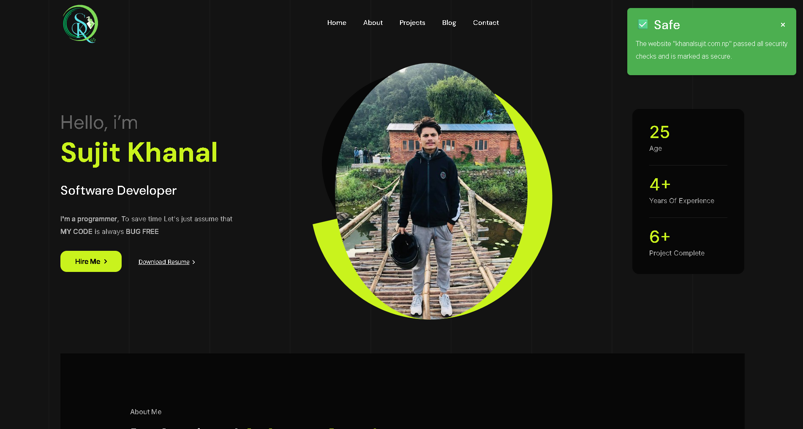

# 🛡️ PhishShield - AI-Based Phishing Detection Extension

PhishShield is a Chrome Extension powered by a FastAPI backend and a trained XGBoost ML model that detects phishing websites in real-time using both URL features and Google Safe Browsing API.

---

## 🚀 Features

- ✅ Chrome extension to scan the active tab's URL
- ✅ Detects phishing based on ML features (obfuscation, HTTPS, external refs, etc.)
- ✅ Uses Google Safe Browsing API for extra protection
- ✅ Displays safety notification badge ("Safe" or "Phishing")
- ✅ FastAPI-based backend with real-time prediction
- ✅ Automatically updates on URL change
- ✅ Trained XGBoost model using a rich feature set

---

## 🧠 How It Works

1. User opens a website in Chrome.
2. Extension sends the current tab’s URL to the backend.
3. Backend:
   - Extracts 20+ intelligent features (JS/CSS/Image count, HTTPS, obfuscation, etc.)
   - Uses XGBoost ML model to classify the URL
   - Optionally checks against Google Safe Browsing
4. Extension shows notification with result.

---

## 📦 Project Structure

## 🗂️ Project Structure (List View)

- `backend/` – FastAPI backend (phishing detection engine)
  - `utils/`
    - `google_safebrowsing.py` - Google safe browser validation
  - `main.py` – FastAPI app with endpoints (`/predict_url`)
  - `url_feature_extractor.py` – Extracts features from URLs for ML
  - `scaler.pkl` – Pre-trained scaler for normalizing features
  - `xgb_model.json` – Trained XGBoost phishing classification model
  - `requirements.txt` – Python dependencies

- `extension/` – Chrome Extension (frontend)
  - `manifest.json` – Extension config (permissions, scripts, icons)
  - `background.js` – Monitors tabs, sends URL to backend
  - `popup.html` – (Optional) UI when user clicks extension
  - `popup.js` – (Optional) Logic for popup.html
  - `style.css` – (Optional) Styles for popup
  - `icons/` – Extension icons
    - `icon16.png`
    - `icon48.png`
    - `icon128.png`

- `.env` – (Optional) For storing `GOOGLE_SAFE_BROWSING_KEY`
- `README.md` – Project documentation
---

## ⚙️ Backend Setup (FastAPI + ML)

  ```bash
  git clone https://github.com/sujit-codezen/phishShield_extension.git

  cd phishShield_extension/backend/

  python -m venv venv

  source venv/bin/activate  

  pip install -r requirements.txt

  uvicorn app:app --reload
  ```

  ---

  ### 🔐 Google Safe Browsing API (Optional)

  PhishShield optionally integrates with **Google Safe Browsing API** to enhance phishing detection by checking URLs against Google's real-time threat database.

  #### 📌 Get API Key:

  1. Go to the [Google Cloud Console](https://console.cloud.google.com/)
  2. Click **"Select a Project"** → **New Project**
  3. Give your project a name like `PhishShield` and click **Create**
  4. Navigate to **APIs & Services → Library**
  5. Search for **Safe Browsing API** and click **Enable**
  6. Go to **APIs & Services → Credentials**
  7. Click **Create Credentials** → **API Key**
  8. Copy the generated key

  ### 🔐 Use It in Backend:

  You can set your key as an environment variable (.env):

  ```bash
  GOOGLE_SAFE_BROWSING_KEY=your_api_key_here
  ```

## 🧩 Chrome Extension Setup

### 🔧 Install the Extension Locally

1. Open **Chrome** and go to: `chrome://extensions/`
2. Enable **Developer mode** (top right toggle)
3. Click **Load unpacked**
4. Select the `extension/` folder from this project
5. ✅ Extension is now active and monitoring URLs

## Output



